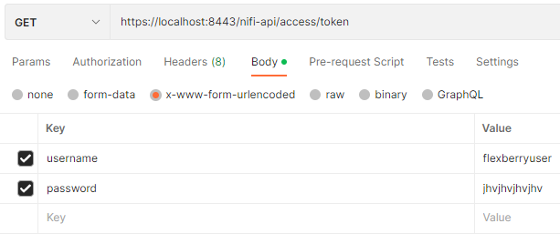

# Работа с NiFi REST API

## Общие сведения
NiFi REST API всегда доступен по относитеьному пути **/nifi-api/**
<br/>Общая документация по REST API https://nifi.apache.org/docs/nifi-docs/rest-api/index.html
<br/>Перед тем как работать с REST API нужно авторизоваться в системе, для этого нужно получить **Bearer Token**
<br/>Для этого нужно отправить GET-запрос на адрес **/nifi-api/access/token**
<br/>Где в Body указать содержимое x-www-form-urlencoded и в параметрах задать username и password.
<br/>Пример из Postman
<br/>

В дальнейшем полученый ключ будем использовать во всех остальных запросах, где укажем тип авторизации **Bearer Token**

## Создание контроллера сервисов
Для создания контроллера сервисов в корневой группе процессов нужно отправить POST-запрос на адрес **/nifi-api/process-groups/root/controller-services**
<br/>Если нужно создать контроллер сервисов не в корневой группе, то вместо **root** в URL указываем **ID** конкретной группы процессов.

Пример содержимого **Body** для создания подключения к **PostgreSQL**:
```json
{
  "revision": {
    "clientId": "a09f2359-0165-1000-bf28-1dca98f6e258",
    "version": 0
  },
  "permissions": {
    "canRead": true,
    "canWrite": true
  },
  "bulletins": [],
  "component": {
    "name": "DBCPConnectionPoolPostgreSQL",
    "type": "org.apache.nifi.dbcp.DBCPConnectionPool",
    "bundle": {
      "group": "org.apache.nifi",
      "artifact": "nifi-dbcp-service-nar",
      "version": "1.20.0"
    },
    "controllerServiceApis": [
        {
            "type": "org.apache.nifi.dbcp.DBCPService",
            "bundle": {
                "group": "org.apache.nifi",
                "artifact": "nifi-standard-services-api-nar",
                "version": "1.20.0"
            }
        }
    ],
    "comments": "",
    "state": "DISABLED",
    "persistsState": false,
    "restricted": false,
    "deprecated": false,
    "multipleVersionsAvailable": false,
    "properties": {
      "Database Connection URL": "jdbc:postgresql://app-postgre-db:5432/appdb",
      "Database Driver Class Name": "org.postgresql.Driver",
      "database-driver-locations": "/opt/jdbc/postgresql-42.5.4.jar",
      "Database User": "flexberryuser",
      "Password": "enc{d65fcc3ac328b4f436f4ffd1227e943587b5835b1f967253a64e3126f3a2302d4e253f}",
      "Max Wait Time": "500 millis",
      "Max Total Connections": "8",
      "Validation-query": null
    },
    "descriptors": {}
  }
}
```

Так же можно взять [проект Postman](files/Nifi.postman_collection.json).