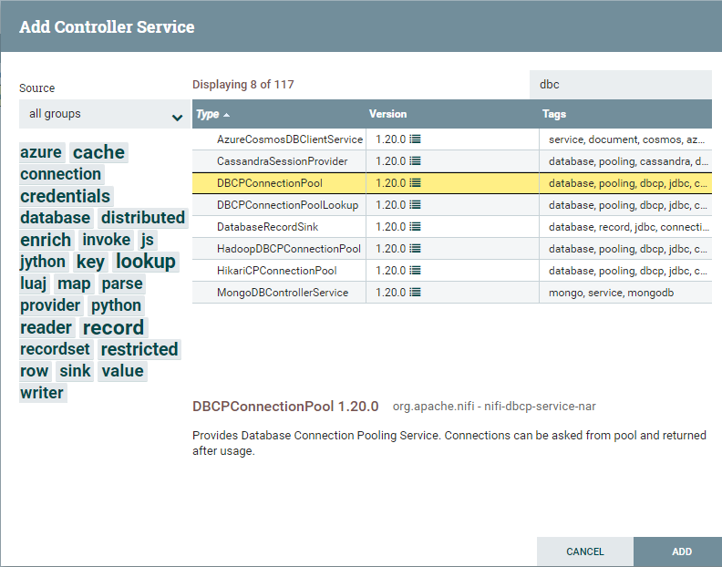
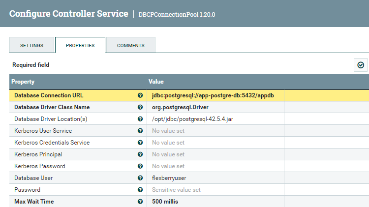
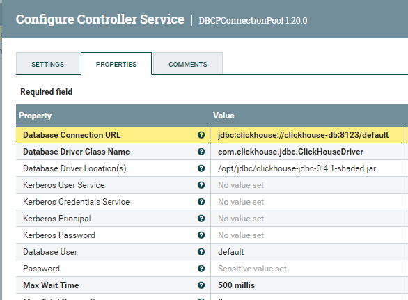
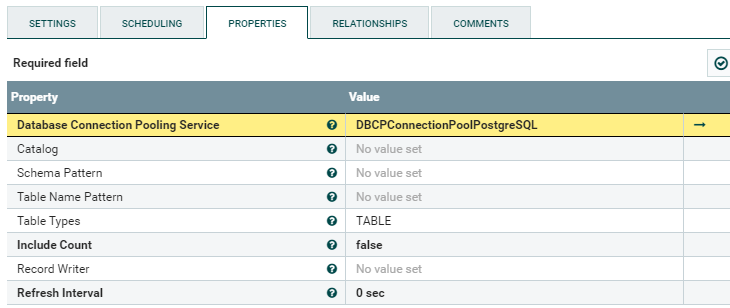
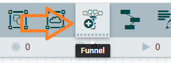
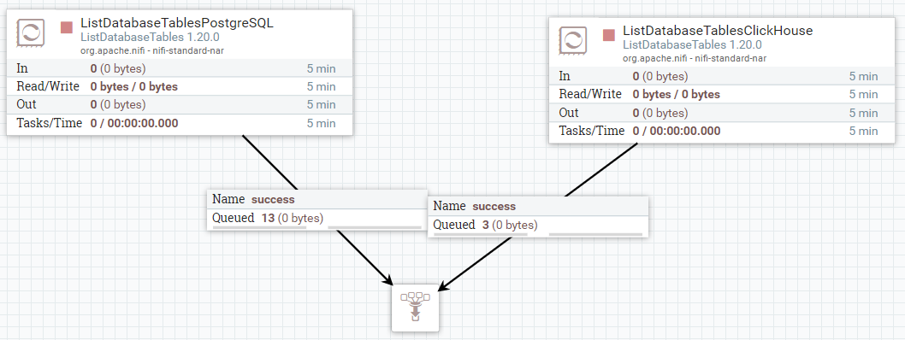

# Настройка источников данных для NiFi и работа с ними

## Источники данных

1. Открываем сайт Nifi https://localhost:8443/nifi/
 логин: flexberryuser
 пароль: jhvjhvjhvjhv

2. Открываем конфигурацию группы потоков
 

3. Добавляем источник данных
 Вкладка **Controller Services**, конопка **Create** справа над списком
 

4. Выбираем тип источника данных
 Нас интересует тип **DBCPConnectionPool 1.20.0**
 

5. Редактируем источник данных
 В списке появится наш источник данных, для редактирования нажимаем кноку **configure** (мальенькая шестеренка)
 

6. Задаем параметры для нашего соединения
 Вкладка **Settings**, атрибут **Name** = DBCPConnectionPoolPostgreSQL
 
 Вкладка **Properties**
 Атрибут **Database Connection URL** = jdbc:postgresql://app-postgre-db:5432/appdb (имя_сервера:порт/имя_бд)
 Атрибут **Database Driver Class Name** = org.postgresql.Driver
 Атрибут **Database Driver Location(s)** = /opt/jdbc/postgresql-42.5.4.jar (этот пакет т.к. он используется в [докере](https://github.com/Flexberry/Flexberry.NiFiSample/blob/ac70635e8c4cc7626efa6fe3f48e6e90bb646020/src/Docker/Dockerfile.NiFi#L9))
 Атрибут **Database User** = flexberryuser
 Атрибут **Database Password** = jhv ([Параметры БД](https://github.com/Flexberry/Flexberry.NiFiSample/blob/ac70635e8c4cc7626efa6fe3f48e6e90bb646020/src/Docker/SQL/Dockerfile.PostgreSql#L4))
 
 Применяем изменения, кнопка **Apply**

7. Включаем источник данных
 Кнопка в виде молнии **Enable**
 

После этого источником данных можно пользоваться.

Чтобы снова отредактировать источник данных, нужно его сначала выключить, кнопка **Disable**, а затем нажать на кнопку **Configure**.

8. Задаем параметры для ClickHouse
 Вкладка **Settings**, атрибут **Name** = DBCPConnectionPoolClickHouse
 Вкладка **Properties**
 Атрибут **Database Connection URL** = jdbc:clickhouse://audit-clickhouse-db:8123/default (имя_сервера:порт/имя_бд)
 Атрибут **Database Driver Class Name** = com.clickhouse.jdbc.ClickHouseDriver
 Атрибут **Database Driver Location(s)** = /opt/jdbc/clickhouse-jdbc-0.4.1-shaded.jar (этот пакет т.к. он используется в [докере](https://github.com/Flexberry/Flexberry.NiFiSample/blob/ac70635e8c4cc7626efa6fe3f48e6e90bb646020/src/Docker/Dockerfile.NiFi#L9))
 Атрибут **Database User** = default
 Атрибут **Database Password** = P@ssw0rd ([Параметры БД](https://github.com/Flexberry/Flexberry.NiFiSample/blob/ac70635e8c4cc7626efa6fe3f48e6e90bb646020/src/Docker/SQL/Dockerfile.ClickHouse#L8))
 
 Применяем изменения, кнопка **Apply**

## Пример использования

Для примера вызовем формирование списка всех имен таблиц в базе данных

1. Создаем процессор
 В главном окне на панели инструментов нажимаем на **Processor** и перетаскиваем его в рабочую область
 
 Выбираем тип **ListDatabaseTables 1.20.0**

2. Редактируем процессор
 Вкладка **Settings**, атрибут **Name** = ListDatabaseTablesPostgreSQL
 Вкладка **Properties**, атрибут **Database Connection Pooling Service** = DBCPConnectionPoolPostgreSQL (выбрать из списка)
 
 Применяем изменения, кнопка **Apply**

3. Аналогично с п.2 добавляем процессор для ClickHouse
 Вкладка **Settings**, атрибут **Name** = ListDatabaseTablesClickHouse
 Вкладка **Properties**, атрибут **Database Connection Pooling Service** = DBCPConnectionPoolClickHouse (выбрать из списка)

4. Добавляем объект Funnel
 В главном окне на панели инструментов нажимаем на **Funnel** и перетаскиваем его в рабочую область
 
 Соединяем наши процессоры с Funnel. Наводим указателем на центр процессора в рабочей области, появится стрелка, 
 
 перетаскиваем ее на объект Funnel, пока линия соединения не станет зеленого цвета.

5. Примерная схема, которая должна получится
 

Можно дергать каждый процесс отдельно. Для этого нажимаем правой кнопкой мыши на процессор и выбираем пункт **Run once**.

## Сбор данных из Excel

Положим файл в докер-контейнер. Для тестирования можно скопировать .xlsx файл с локальной машины в докер-контейнер nifi. Для этого:

1. Создаем файл, например `cars.xlsx` на локальной машине.
2. Присоединяемся терминалом (например, с помощью плагина Doker в VS Code) к контейнеру `nifisample/nifi`. Создадим директорию для файлов командой `mkdir excelsheets`
3. В другом, не подсоединенном к докеру терминале выполняем команду `docker cp <полный_путь_до_файла>\cars.xlsx <id_контейнера>:/opt/nifi/nifi-current/excelsheets/cars.xlsx`.

Вычитаем данные из Excel файла в NiFi:

1. Из меню сверху перетягиваем на рабочую зону Processor, из списка выбираем `GetFile`
2. На вкладке Properties:
   1. Input Directory - путь до файла в контейнере, в нашем случае `/opt/nifi/nifi-current/excelsheets`
   2. File Filter - фильтр на имя файла. Можно задавать маски, но в нашем тестовом случае прописываем имя конкретного файла - `cars.xlsx`

3. Добавляем еще один Processor - `ConvertExcelToCSVProcessor`. На вкладке Properties в поле `Sheets to Extract` прописываем имена листов из excel файла, которые хотим передать.
4. Соединяем стрелочкой объекты GetFile и ConvertExcelToCSVProcessor.
5. Добавляем в рабочую зону объект Funnel. Соединяем ConvertExcelToCSVProcessor с Funnel тремя стрелками - отдельно для failure, success, original.

Готово, можно запускать процессы передачи.
