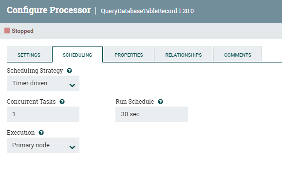
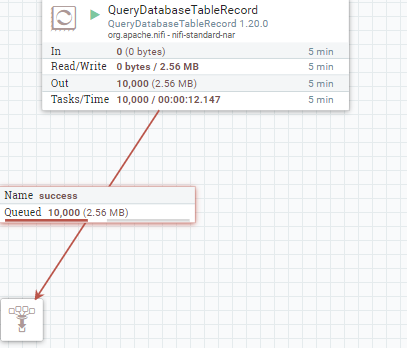
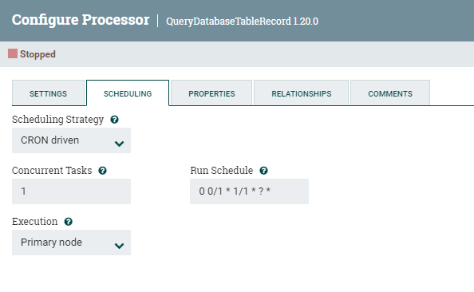

# Настройка планировщика для процессоров

1. Открываем конфигурацию процессора и заходим во вкладку **SCHEDULING**.
2. Нужны в контексте данной инструкции следующие настройки:
   - **Scheduling Strategy**: непосредственно режим
   - **Run Schedule**: промежуток времени (отсутствует для режима **Event driven**)

3. Режимы
    ## Timer driven
    - Режим по умолчанию. Процесс запускается через регулярные промежутки времени
    - В **Run Schedule** нужно указать нужный промежуток, например: *30 sec*; *5 mins*:
     

    - Если указать значение 0 (с любой единицей времени), то процессор будет запускаться как можно чаще, пока есть данные для обработки
    - Например, при вычитки данных мгновенно появились идентичные записи в количестве 10000 (значение по умолчанию):
     

    ## CRON driven
    - Режим, аналогичный предыдущему, но с более сложной конфигурацией, а следовательно и более гибкий.
    - Подробнее о CRON-expressions: https://www.quartz-scheduler.org/documentation/quartz-2.2.2/tutorials/tutorial-lesson-06.html
    - Пример для периодического запуска каждую минуту:
     

    ## Event driven
    - Экспериментальный режим, который поддерживается НЕ всеми процессорами. В документации отмечается, что API, внутреннее поведение и конфигурация могут измениться без предупреждения, поэтому гарантий правильно работоспособности нет. (https://nifi.apache.org/docs/nifi-docs/html/user-guide.html#scheduling-tab).
    - Актуальным для вычитки из БД, например, для данного проекта является процессор QueryDatabaseTableRecord. Как раз для него даже не предусмотрен вариант с данным режимом (попросту нет варианта при выборе из выпадающего списка).