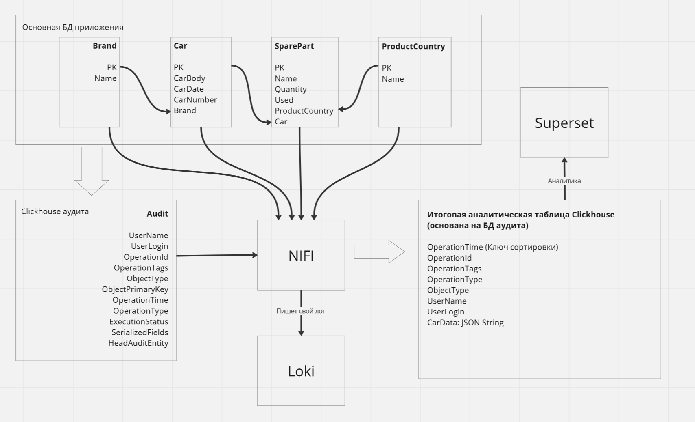

# Общая инструкция Flexberry.NiFiSample

Приложение для примера работы с Apache NiFi состоит из web стенда, postgres базы данных приложения, clickhouse баз данных аудита и аналитической таблицы, а также сервисов Grafana Loki, NiFi, Superset. Все это развернуто в докере.

## Последовательность действий для запуска

1. Собрать Docker-образы

```
\src\Docker> .\create-image.cmd
```

2. Запустить Docker-образы

```
\src\Docker> .\start.cmd
```

3. В запущенном из образа nifisample/audit-clickhouse контейнере (например, с помощью плагина Doker в VS Code - нажать правой кнопкой мыши по контейнеру -> Attach Shell) выполнить команду для создания таблицы

```
clickhouse-client --host audit-clickhouse-db --user default --password P@ssw0rd --multiquery < /var/clickhouse/schema/ClickhouseAuditCreate.sql
```

Для nifisample/clickhouseanalytics:

```
clickhouse-client --host clickhouse-analytics-db --user default --password P@ssw0rd --multiquery < /var/clickhouse/schema/ClickhouseAnalytics.create.sql
```

Теперь все запущено

## Общая архитектура

Архитектура приложения представляется следующим образом:



Данные об объектах из postgres бд приложения, а также данные аудита приложения из clickhouse попадают в NiFi. NiFi отправляет логи в Loki, а также формирует поступающие в него данные для аналитической таблицы, после чего посылает их в аналитическую базу данных. Из аналитической бд данные идут в Superset для дальнейшей аналитики.

## Алгоритм формирования аналитических данных

Алгоритм формирования аналитических данных на схеме выглядит так:


Вычитываем запись из бд аудита. Смотрим на ObjectType и в зависимости от типа объекта выполняем действия:

* Тип Brand:
  1. Вычитываем запись Brand
  2. Вычитываем мастер BrandCountry
  3. Вычитываем детейлы Car
  4. Для каждого Car вычитываем детейлы SparePart, а для каждого SparePart вычитываем Product Country

* Тип ProductCountry:
  1. Вычитываем запись ProductCountry
  2. Вычитываем детейлы SparePart
  3. Вычитываем мастер Car для каждого SparePart
  4. Вычитываем мастер Brand для Car

* Тип SparePart:
  1. Вычитываем запись SparePart
  2. Вычитываем мастер Car
  3. Вычитываем мастер Brand для Car
  4. Двычитываем детейлы SparePart мастера Car

* Тип Car:
  1. Вычитываем запись Car
  2. Вычитываем мастер BrandCountry для Brand
  3. Вычитываем мастер Brand
  4. Вычитываем детейлы SparePart

После выполнения этих действий формируем из полученных данных поле CarData.

## Запуск примера в Nifi

1. Заходим в NiFi (<https://localhost:8443/> логин: flexberryuser пароль: jhvjhvjhvjhv)
2. Для примера сделана заготовка Process Group, она лежит в репозитории по пути `templates\NiFi_Flow.json`. Добавляем эту заготовку, перетаскивая элемент группы процессов из меню сверху на рабочую поверхность:
   
   В открывшемся окне выбираем сохраненную группу процессов нажав на кнопку с иконкой и после нажимаем кнопку Add:
   
   Появятся две группы процессов - одна отвечает за забор данных из postgres бд объектов приложения и clickhouse бд аудита, формирование данных для аналитической бд и передачу этих данных в аналитическую бд clickhouse; вторая группа процессов передает логи в Loki:
   
3. Перед тем, как запустить процессы, нужно зайти в группу процессов `NiFi_Flow_Clickhouse_Audit_To_Analytics`, кликнув по ней два раза. Слева на плашке operate кликаем по значку шестеренки. В открывшемся окне настроек переключаемся на вкладку controller services, где нужно прописать пароль для подлючения к бд для трех контроллеров:
   
   Для выделенных контроллеров заходим в настройки, нажав на шестеренку. На вкладке properties прописываем пароль. Для `DBCPConnectionPoolClickhouseAnalytics` и `DBCPConnectionPoolClickhouseAudit` - `P@ssw0rd`, для `DBCPConnectionPoolPostgreSQL` - `jhv`:
   
4. После можно возвращаться на главную рабочую зону, кликнув по ее названию в пути внизу страницы:
   
5. Теперь можно кликать правой кнопкой мыши по пустому пространству на рабочей поверхности и запустить сначала все контроллеры, а затем все процессы:
   

> **_NOTE:_** Более подробные инструкции для выполнения отдельных шагов есть в папке docs.

## Описание процессов примера NiFi

Работа группы процессоров `Clickhouse_Audit_To_Analytics`:

1. CH Audit QueryDatabaseTableRecord вычитывает данные из базы аудита
2. SplitJson разделяет полученный массив данных на отдельные записи
3. EvaluateJsonPath извлекает атрибуты (primaryKey, UserLogin, ObjectType и т.д.)
4. UpdateAttribute корректирует некоторые полученные значения объектов
5. ObjectType RouteOnAttribute является разделителем. В зависимости от того, какой тип объекта пришел, идем в разные ветки
6. SparePart UpdateAttribute используется при получении объекта типа SparePart. Тогда для него вычитываем мастер Car.
7. ExecuteSQLRecord вычитывает данные объектов из бд postgres
8. JoltTransformJSON преобразует полученный json и сгруппировывает их в нужном нам виде
9. ExtractText добавляет сформированный атрибут
10. AttributesToJSON конвертирует атрибуты в json
11. ReplaceText корректирует данные, если они были неверно сформированы
12. CH Analytics PutDatabaseRecord записывает получнную запись в аналитическую бд.

Работа группы процессоров `Log_To_LokiAPI`:

1. TailFile AppLog периодически просматривает файлы логов nifi. При изменении файла новые строки извлекаются
2. ConvertRecord конвертирует полученные текстовые строки логов в json
3. SplitJson разделяет json на атрибуты
4. JSLTTransformJSON преобразует время к наносекундам и формирует новый вид JSON
5. InvokeHTTP Loki API отправляет данные в Loki
6. DebugFlow помогает тестировать и отлаживать структуру потока данных, позволяя явно запускать различные ответы в ответ на получение данных.

> **_NOTE:_** Более подробные описания и инструкции процессов находятся в папке docs.

## Пример работы с системой

1. Запускаем процессы в NiFi, как описано выше
2. Заходим в веб приложение <http://localhost> и выполняем действия с объектами. Для автоматической генерации тестовых данных есть кнопка `Добавить тестовые данные`:
   
3. В postgres базе приложения (<http://localhost:5432/> логин: flexberryuser пароль: jhv) появляются добавленные объекты, а в clickhouse базе аудита (<http://localhost:8123/> логин: default пароль: P@ssw0rd) отображается информация о действиях с объектами.
4. Данные должны попасть в Nifi. Об успешности процессов можно узнать по ветке у последнего звена процесса (количество queued должно быть больше 0). Для AuditToAnalytics этот элемент находится здесь:
   
   Для LogToLokiAPI здесь:
   
5. Теперь сформированные данные должны попасть в аналитическую базу данных clickhouse (<http://localhost:8124/> логин: default пароль: P@ssw0rd)
6. Данные логов должны оказаться в Loki. Проверить можно через Grafana (<http://localhost:3000/> логин: admin пароль: usr123). Подключаем Loki, выбрав его в разделе Data sources, прописав строку подключения и сохранив соединение:
   
   Сами логи можно посмотреть в разделе Explore. Подробнее про работу со стеком Grafana Loki можно узнать в документации репозитория [Flexberry.Logging.Sample](https://github.com/Flexberry/Flexberry.Logging.Sample)
