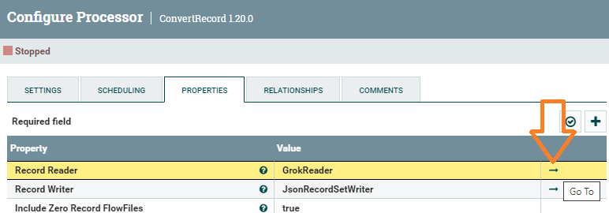
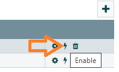
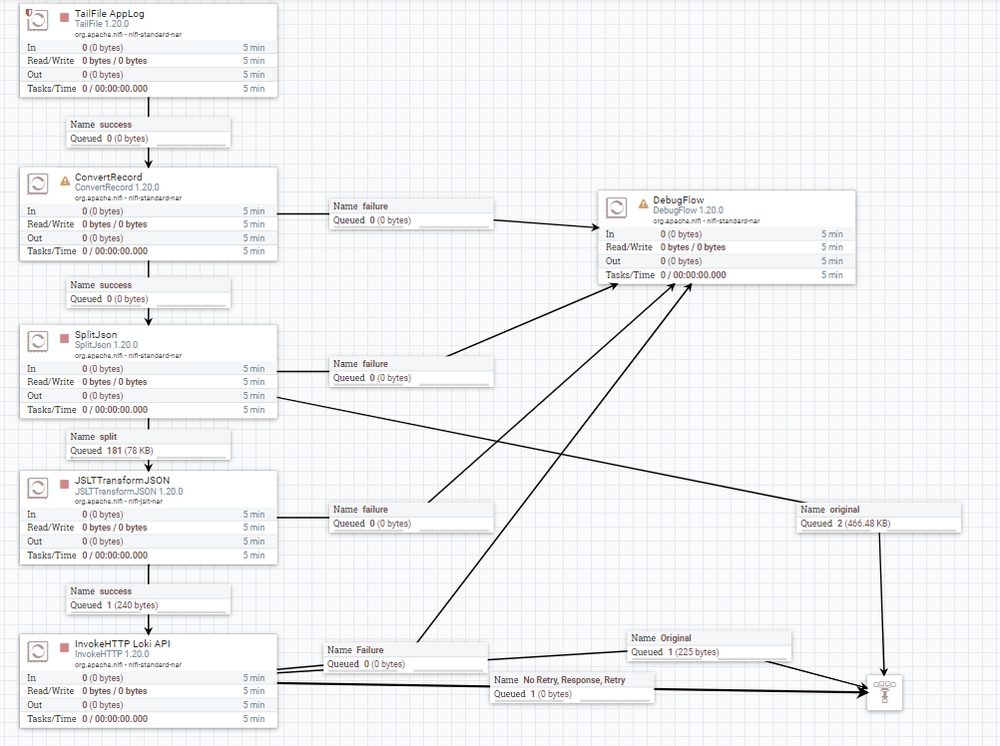

# Отправка логов NiFi в Loki API

## Описание задачи
Необходимо взять все строки собственного лога NiFi, преобразовать их в нужный формат и отправить в Grafana Loki.

Параметры:
* Путь к файлу логов NiFi: ./logs/nifi-app.log
* Адрес Loki API: http://loki:3100/loki/api/v1/push
* Формат сообщения для Loki API: https://grafana.com/docs/loki/latest/api/#push-log-entries-to-loki

Формат Loki API в JSON:
```json
{
  "streams": [
    {
      "stream": {
        "label": "value"
      },
      "values": [
          [ "<unix epoch in nanoseconds>", "<log line>" ],
          [ "<unix epoch in nanoseconds>", "<log line>" ]
      ]
    }
  ]
}
```

Т.е. необходимо не только сформировать нужный JSON, но и преобразовать время в наносекунды.

## Пример конкретного преобразования

Строка из файла лога NiFi:
```log
2023-03-27 07:36:53,776 INFO [Timer-Driven Process Thread-10] o.a.n.c.s.StandardProcessScheduler Stopping TailFile[id=d4ca0f00-63cc-3908-d437-f6aca69afcd9]
```

JSON для отправки в Loki API:
```json
{
  "streams" : [ {
    "stream" : {
      "Level" : "INFO",
      "thread" : "Timer-Driven Process Thread-10",
      "logger" : "o.a.n.c.s.StandardProcessScheduler"
    },
    "values" : [ [ "1679902613776000000", "Stopping TailFile[id=d4ca0f00-63cc-3908-d437-f6aca69afcd9]" ] ]
  } ]
}
```

## Настройка NiFI

### Берем файл лога NiFi
Добавляем процесор **TailFile**.
</br>Вкладка **Properties**, атрибут **File(s) to Tail** = ./logs/nifi-app.log

### Парсим строку лога и формируем из нее простой JSON
1. Добавляем процесор **ConvertRecord**.
</br>Вкладка **Properties**, атрибут **Record Reader**, выбираем пункт **Create new service...**, затем выбираем **GrokReader**, и переходим к его редактированию по кнопке **Go To** справа
</br>
2. Редактируем **GrokReader**
</br>Вкладка **Properties**, атрибут **Grok Expressions** = %{TIMESTAMP_ISO8601:date} %{LOGLEVEL:Level} \[%{DATA:thread}] %{DATA:logger} %{GREEDYDATA:message}
</br>*Подробнее о форматах Grok тут:* https://github.com/elastic/logstash/blob/v1.4.2/patterns/grok-patterns
3. Продолжаем редактировать процесор **ConvertRecord**.
</br>Вкладка **Properties**, атрибут **Record Writer**, выбираем пункт **Create new service...**, затем выбираем **JsonRecordSetWriter**, и переходим к его редактированию по кнопке **Go To** справа и активируем оба сервиса **GrokReader** и **JsonRecordSetWriter**
</br>

Теперь у нас на выходе получается один **большой** плоский JSON:
```json
[
    {
        "date" : "2023-03-27 07:36:53,776",
        "Level" : "INFO",
        "thread" : "Timer-Driven Process Thread-10",
        "logger" : "o.a.n.c.s.StandardProcessScheduler",
        "message" : "Stopping TailFile[id=d4ca0f00-63cc-3908-d437-f6aca69afcd9]",
        "stackTrace" : null,
        "_raw" : "2023-03-27 07:36:53,776 INFO [Timer-Driven Process Thread-10] o.a.n.c.s.StandardProcessScheduler Stopping TailFile[id=d4ca0f00-63cc-3908-d437-f6aca69afcd9]"
    }
    (...)
]
```

### Разделяем большой JSON на маленькие сообщения
Добавляем процессор **SplitJson**
</br>Вкладка **Properties**, атрибут **JsonPath Expression** = $.*
</br>*Протестировать JSON Expression можно тут:* https://jsonpath.com/
</br>На выходе получаем уже одинарный JSON:
```json
{
  "date" : "2023-03-27 07:36:53,776",
  "Level" : "INFO",
  "thread" : "Timer-Driven Process Thread-10",
  "logger" : "o.a.n.c.s.StandardProcessScheduler",
  "message" : "Stopping TailFile[id=d4ca0f00-63cc-3908-d437-f6aca69afcd9]",
  "stackTrace" : null,
  "_raw" : "2023-03-27 07:36:53,776 INFO [Timer-Driven Process Thread-10] o.a.n.c.s.StandardProcessScheduler Stopping TailFile[id=d4ca0f00-63cc-3908-d437-f6aca69afcd9]"
}
```

### Преобразуем JSON в JSON
Добавляем процессор **JSLTTransformJSON**
</br>Вкладка **Properties**, атрибут **JSLT Transformation** = 
```java
let dt = parse-time(.date, "yyyy-MM-dd HH:mm:ss")
let dts = split($dt + "", "E")
let fff = split(.date, ",")[1]
let ts = $dts[0][0] + $dts[0][2 : 11] + $fff + "000000"

{
  "streams": [
    {
      "stream": {
        "Level" : .Level,
        "thread" : .thread,
        "logger" : .logger,
      },
      "values": [
          [ $ts, .message ]
      ]
    }
  ]
}

```
Тут преобразуется время к наносекундам и формируется новый вид JSON

Подробнее про JSLT:

https://github.com/schibsted/jslt/blob/master/README.md
https://github.com/schibsted/jslt/blob/master/functions.md
https://github.com/schibsted/jslt/blob/master/ideas/time.md

Отладка JSLT: https://www.garshol.priv.no/jslt-demo

Перевод времени в наносекунды: https://www.epochconverter.com/

Результат:
```json
{
  "streams" : [ {
    "stream" : {
      "Level" : "INFO",
      "thread" : "Timer-Driven Process Thread-10",
      "logger" : "o.a.n.c.s.StandardProcessScheduler"
    },
    "values" : [ [ "1679902613776000000", "Stopping TailFile[id=d4ca0f00-63cc-3908-d437-f6aca69afcd9]" ] ]
  } ]
}
```

### Отправляем данные в Loki API
Добавляем процессор **InvokeHTTP**
</br>Вкладка **Properties**, атрибут **HTTP URL** = http://loki:3100/loki/api/v1/push
</br>Атрибут **HTTP Method** = POST
</br>Атрибут **Request Content-Type** = application/json

## Общая схема
</br>