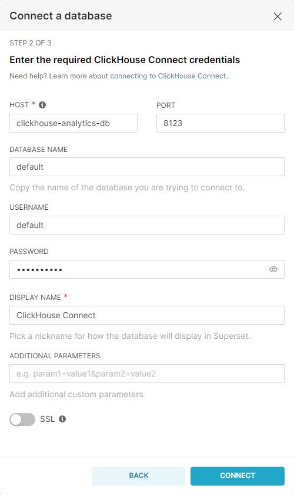

# Подключение в Superset к аналитической БД

1. Зайти в интерфейс Superset http://localhost:4200/login/.
2. Авторизоваться (настройки авторизации заданы в файле /src/Docker/Superset/Dockerfile.Superset).
    - Логин: admin
    - Пароль: c1ickh0u5e
3. Создать подключение к БД аналитики ClickHouse.
	- Выбрать пунк меню "+" → "Data" → "Connect database".
	 
	- В окне "Connect a database":
		1. В пункте "SUPPORTED DATABASES" выбрать из списка "ClickHouse Connect"
		 
		2. Задать параметры подключения.
			+ HOST: clickhouse-analytics-db
			+ PORT: 8123
			+ DATABASE NAME: default
			+ USERNAME: default (см. файл /src/SQL/ClickhouseAnalyticsSettings/users.xml)
			+ PASSWORD: P@ssw0rd (см. файл /src/SQL/ClickhouseAnalyticsSettings/users.xml)
			+ DISPLAY NAME: Analytics ClickHouse Connect
			 
			+ Нажать "CONNECT".
		3. При необходимости, задать дополнительные параметры. Нажать кнопку "FINISH".