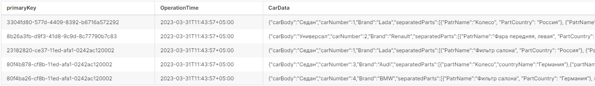
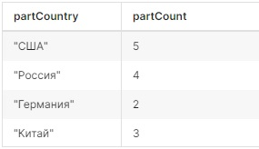

# Построению аналитических запросов в Superset

Рассмотрим построение аналитических запросов в Superset на конкретном примере.

## Постановка задачи
### Исходные данные
Пусть имеется некоторая таблица с данными. На рис. 1 представлена её часть с наиболее значащими полями.<br>


### Требуется
Получить по каждой стране общее количество запчастей, т.е. сформировать таблицу следующего вида:
<table style="width:300px;">
	<thead>
		<tr>
			<th>partCountry</th>
			<th>partCount</th>
		</tr>
	</thead>
	<tbody>
		<tr>
			<td>Россия</td>
			<td>5</td>
		</tr>
		<tr>
			<td>Китай</td>
			<td>3</td>
		</tr>
		<tr>
			<td>...</td>
			<td>...</td>
		</tr>
	</tbody>
</table>

## Решение

Для контроля полученного результата и наглядности решения представим содержимое поля CarData.

<table style="width:;">
	<thead>
		<tr>
			<th>CarData</th>
		</tr>
	</thead>
	<tbody>
		<tr>
			<td>{"carBody":"Седан",
				<br>&nbsp;&nbsp;"carNumber":1,
				<br>&nbsp;&nbsp;"Brand":"Lada",
				<br>&nbsp;&nbsp;"separatedParts":[
				<br>&nbsp;&nbsp;&nbsp;&nbsp;&nbsp;&nbsp;{"PatrName":"Колесо", "PartCountry": "Россия"},
				<br>&nbsp;&nbsp;&nbsp;&nbsp;&nbsp;&nbsp;{"PatrName":"Лобовое стекло", "PartCountry": "Россия"},
				<br>&nbsp;&nbsp;&nbsp;&nbsp;&nbsp;&nbsp;{"PatrName":"Стойка передняя, левая", "PartCountry": "США"}
				<br>&nbsp;&nbsp;]<br>}</td>
		</tr>
		<tr>
			<td>{"carBody":"Универсал",
				<br>&nbsp;&nbsp;"carNumber":2,
				<br>&nbsp;&nbsp;"Brand":"Renault",
				<br>&nbsp;&nbsp;"separatedParts":[
				<br>&nbsp;&nbsp;&nbsp;&nbsp;&nbsp;&nbsp;{"PatrName":"Фара передняя,
				 левая", "PartCountry": "Россия"},
				 <br>&nbsp;&nbsp;&nbsp;&nbsp;&nbsp;&nbsp;{"PatrName":"Колесо", "PartCountry": "США"},
				 <br>&nbsp;&nbsp;&nbsp;&nbsp;&nbsp;&nbsp;{"PatrName":"Зеркало", "PartCountry": "Китай"},
				 <br>&nbsp;&nbsp;&nbsp;&nbsp;&nbsp;&nbsp;{"PatrName":"Датчик дождя", "PartCountry": "Китай"}
				 <br>&nbsp;&nbsp;]<br>}</td>
		</tr>
		<tr>
			<td>{"carBody":"Седан","carNumber":1,
				<br>&nbsp;&nbsp;"Brand":"Lada",
				<br>&nbsp;&nbsp;"separatedParts":[
				<br>&nbsp;&nbsp;&nbsp;&nbsp;&nbsp;&nbsp;{"PatrName":"Фильтр салона", "PartCountry": "Россия"},
				<br>&nbsp;&nbsp;&nbsp;&nbsp;&nbsp;&nbsp;{"PatrName":"Стойка передняя, правая", "PartCountry": "США"}
				<br>&nbsp;&nbsp;]<br>}</td>
		</tr>
		<tr>
			<td>{"carBody":"Седан",
			<br>&nbsp;&nbsp;"carNumber":3,
			<br>&nbsp;&nbsp;"Brand":"Audi",
			<br>&nbsp;&nbsp;"separatedParts":[
			<br>&nbsp;&nbsp;&nbsp;&nbsp;&nbsp;&nbsp;{"partName":"Колесо", "PartCountry":"Германия"},
			<br>&nbsp;&nbsp;&nbsp;&nbsp;&nbsp;&nbsp;{"partName":"Зеркало", "PartCountry":"США"}
			<br>&nbsp;&nbsp;]<br>}</td>
		</tr>
		<tr>
			<td>{"carBody":"Седан",
			<br>&nbsp;&nbsp;"carNumber":4,
			<br>&nbsp;&nbsp;"Brand":"BMW",
			<br>&nbsp;&nbsp;"separatedParts":[
			<br>&nbsp;&nbsp;&nbsp;&nbsp;&nbsp;&nbsp;{"PatrName":"Фильтр салона", "PartCountry": "Германия"},
			<br>&nbsp;&nbsp;&nbsp;&nbsp;&nbsp;&nbsp;{"PatrName":"Фара передняя, левая", "PartCountry": "США"},
			<br>&nbsp;&nbsp;&nbsp;&nbsp;&nbsp;&nbsp;{"PatrName":"Датчик холостого хода", "PartCountry": "Китай"}
			<br>&nbsp;&nbsp;]<br>}</td>
		</tr>
	</tbody>
</table>

Для получения данных из JSON-представления, воспользуемся возможностями ClickHouse. Создадим и выполним следующий запрос в Superset (SQL → SQL Lab) для получения требуемых данных.

```
SELECT partCountry, COUNT() as partCount FROM (
  SELECT
    JSONExtractRaw(CarData, 'separatedParts', 1,'PartCountry') AS partCountry
  FROM Analitics
  WHERE notEmpty(partCountry)
  UNION ALL
  SELECT
    JSONExtractRaw(CarData, 'separatedParts', 2,'PartCountry') AS partCountry
  FROM Analitics
  WHERE notEmpty(partCountry)
  UNION ALL
  SELECT
    JSONExtractRaw(CarData, 'separatedParts', 3,'PartCountry') AS partCountry
  FROM Analitics
  WHERE notEmpty(partCountry)
  UNION ALL
  SELECT
    JSONExtractRaw(CarData, 'separatedParts', 4,'PartCountry') AS partCountry
  FROM Analitics
  WHERE notEmpty(partCountry)
)
GROUP BY partCountry
```

Количество "UNION ALL" зависит от количества элементов массива "separatedParts".


## Полученный результат
Результатом выполненного запроса является следующая таблица:<br>



## Полезные источники
1. [Функции для работы с JSON](https://clickhouse.com/docs/ru/sql-reference/functions/json-functions)