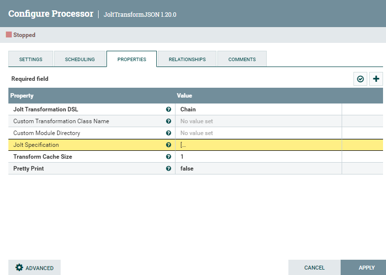
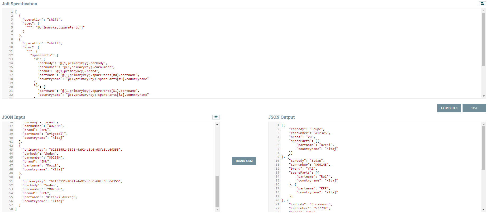

# Процессор JSON-преобразования JoltTransformJSON

Для преобразования одного JSON к другому по некоторым условиям можно сделать через процессор **JoltTransformJSON**.

Подробнее про преобразование:
<br/>https://jolt-demo.appspot.com/#inception (онлайн редактор с примерами)
<br/>https://nifichina.github.io/jolt/JOLTIntroduction.pdf
<br/>https://intercom.help/godigibee/en/articles/4239806-transformations-with-jolt
<br/>https://intercom.help/godigibee/en/articles/4044359-transformer-getting-to-know-jolt

**Общий принцип работы:** выбираем данные (селектор), определяем им новое имя/положение в результирующем JSON.

Вкладка **Properties**, свойство **Jolt Specification** отвечает за преобразование.
<br/>

По кнопке **Advanced** слева внизу можно вызвать окно тестирования преобразования.
<br/>

## Пример преобразования данных
Есть данные по машинам
```json
[
  {
    "primarykey": "6bc5ec5a-6d4f-482f-8fbc-68d451de6a70",
    "carbody": "Coupe",
    "carnumber": "A123VS",
    "brand": "VW",
    "partname": "Dveri",
    "countryname": "Kitaj"
  },
  {
    "primarykey": "15c31a42-0273-4efb-94b0-2ca15f1dd336",
    "carbody": "Sedan",
    "carnumber": "K001MS",
    "brand": "VAZ",
    "partname": "Rul`",
    "countryname": "Kitaj"
  },
  {
    "primarykey": "15c31a42-0273-4efb-94b0-2ca15f1dd336",
    "carbody": "Sedan",
    "carnumber": "K001MS",
    "brand": "VAZ",
    "partname": "KPP",
    "countryname": "Kitaj"
  },
  {
    "primarykey": "df6b49f6-570e-407f-8336-a6014a18d820",
    "carbody": "Crossover",
    "carnumber": "V777OR",
    "brand": "VAZ",
    "partname": "Dvornki",
    "countryname": "Kitaj"
  },
  {
    "primarykey": "62183551-8391-4a92-b5c6-68fc5bc6d355",
    "carbody": "Sedan",
    "carnumber": "O025SM",
    "brand": "BMW",
    "partname": "Dvigatel`",
    "countryname": "Kitaj"
  },
  {
    "primarykey": "62183551-8391-4a92-b5c6-68fc5bc6d355",
    "carbody": "Sedan",
    "carnumber": "O025SM",
    "brand": "BMW",
    "partname": "Mozgi",
    "countryname": "Kitaj"
  },
  {
    "primarykey": "62183551-8391-4a92-b5c6-68fc5bc6d355",
    "carbody": "Sedan",
    "carnumber": "O025SM",
    "brand": "BMW",
    "partname": "Rizinki dverej",
    "countryname": "Kitaj"
  }
]
```
Поля относящиеся к машине
* primarykey
* carbody
* carnumber
* brand

Поля части машины
* partname
* countryname

Задача сгруппировать данные по машинам и поместить данные по частям машины в массив **spareParts**.

Вот что должно получится:
```json
[{
	"carbody": "Coupe",
	"carnumber": "A123VS",
	"brand": "VW",
	"spareParts": [{
		"partname": "Dveri",
		"countryname": "Kitaj"
	}]
}, {
	"carbody": "Sedan",
	"carnumber": "K001MS",
	"brand": "VAZ",
	"spareParts": [{
		"partname": "Rul`",
		"countryname": "Kitaj"
	}, {
		"partname": "KPP",
		"countryname": "Kitaj"
	}]
}, {
	"carbody": "Crossover",
	"carnumber": "V777OR",
	"brand": "VAZ",
	"spareParts": [{
		"partname": "Dvornki",
		"countryname": "Kitaj"
	}]
}, {
	"carbody": "Sedan",
	"carnumber": "O025SM",
	"brand": "BMW",
	"spareParts": [{
		"partname": "Dvigatel`",
		"countryname": "Kitaj"
	}, {
		"partname": "Mozgi",
		"countryname": "Kitaj"
	}, {
		"partname": "Rizinki dverej",
		"countryname": "Kitaj"
	}]
}]
```

## 1. Сгруппируем все данные по полю **primarykey**
```json
[
  {
    "operation": "shift",
    "spec": {
      "*": "@primarykey.spareParts[]"
    }
  }
]
```

\*: берем все вершины

@primarykey.spareParts[]: 
<br/>@primarykey - берем значение поля primaryKey из текущего обрабатываемого элемента; 
<br/>.spareParts - засовываем в дочернее поле spareParts; 
<br/>[] - всегда создаем массив, даже если тм будет всего один объект

Результат:
```json
{
  "6bc5ec5a-6d4f-482f-8fbc-68d451de6a70" : {
    "spareParts" : [ {
      "primarykey" : "6bc5ec5a-6d4f-482f-8fbc-68d451de6a70",
      "carbody" : "Coupe",
      "carnumber" : "A123VS",
      "brand" : "VW",
      "partname" : "Dveri",
      "countryname" : "Kitaj"
    } ]
  },
  "15c31a42-0273-4efb-94b0-2ca15f1dd336" : {
    "spareParts" : [ {
      "primarykey" : "15c31a42-0273-4efb-94b0-2ca15f1dd336",
      "carbody" : "Sedan",
      "carnumber" : "K001MS",
      "brand" : "VAZ",
      "partname" : "Rul`",
      "countryname" : "Kitaj"
    }, {
      "primarykey" : "15c31a42-0273-4efb-94b0-2ca15f1dd336",
      "carbody" : "Sedan",
      "carnumber" : "K001MS",
      "brand" : "VAZ",
      "partname" : "KPP",
      "countryname" : "Kitaj"
    } ]
  },
  "df6b49f6-570e-407f-8336-a6014a18d820" : {
    "spareParts" : [ {
      "primarykey" : "df6b49f6-570e-407f-8336-a6014a18d820",
      "carbody" : "Crossover",
      "carnumber" : "V777OR",
      "brand" : "VAZ",
      "partname" : "Dvornki",
      "countryname" : "Kitaj"
    } ]
  },
  "62183551-8391-4a92-b5c6-68fc5bc6d355" : {
    "spareParts" : [ {
      "primarykey" : "62183551-8391-4a92-b5c6-68fc5bc6d355",
      "carbody" : "Sedan",
      "carnumber" : "O025SM",
      "brand" : "BMW",
      "partname" : "Dvigatel`",
      "countryname" : "Kitaj"
    }, {
      "primarykey" : "62183551-8391-4a92-b5c6-68fc5bc6d355",
      "carbody" : "Sedan",
      "carnumber" : "O025SM",
      "brand" : "BMW",
      "partname" : "Mozgi",
      "countryname" : "Kitaj"
    }, {
      "primarykey" : "62183551-8391-4a92-b5c6-68fc5bc6d355",
      "carbody" : "Sedan",
      "carnumber" : "O025SM",
      "brand" : "BMW",
      "partname" : "Rizinki dverej",
      "countryname" : "Kitaj"
    } ]
  }
}
```

## 2. Для каждого элемента зайдем в массив spareParts, возьмем оттуда первый элемент, из него поля машины доабим к текущему элементу, остальные поля оставим в sparePart
```json
[
  {
    "operation": "shift",
    "spec": {
      "*": {
        "spareParts": {
          "0": {
            "carbody": "@(1,primarykey).carbody",
            "carnumber": "@(1,primarykey).carnumber",
            "brand": "@(1,primarykey).brand",
            "partname": "@(1,primarykey).spareParts[#0].partname",
            "countryname": "@(1,primarykey).spareParts[#0].countryname"
          },
          "*": {
            "partname": "@(1,primarykey).spareParts[&1].partname",
            "countryname": "@(1,primarykey).spareParts[&1].countryname"
          }
        }
      }
    }
  }
]
```

\* -> spareParts -> 0: берем в каждом элементе массив spareParts, а в нем первый элемент (нимерация с нуля)

\* -> spareParts -> *: берем в каждом элементе массив spareParts, а в нем все остальные элементы кроме первого (только потому что первый обозначен отдельно, иначе взяли бы все)

"carbody": "@(1,primarykey).carbody"
<br/>Берем значение поля **carbody** и помещаем его в вершину под именем **значения поля primarykey** которое располагается на **1 вершину выше нас** (на 1 уровень выше по дереву вложенности, ведь сейчас мы поле carbody, и у нас нет дочернего элемента primarykey, а вот у нашего родителя, элемента массива spareParts, он есть). Так же создаем дочерний элемент carbody, куда и помещаем наше значение
<br/>**carnumber, brand** - аналогично **carbody**

"partname": "@(1,primarykey).spareParts[#0].partname"
<br/>Аналогично **carbody**. Только помещаем мы его в массив **spareParts**, именно в 1 элемент (нумерация с 0), в дочерний элемент **partname**.
<br/>**countryname** - аналогично **partname**

Для остальных вершин **spareParts**, перемещаем только **partname** и **countryname**. Т.к. собсвенные поля для машины мы уже взяли и они везде повторяются.

"partname": "@(1,primarykey).spareParts[&1].partname"
<br/>Единственная особенность - это номер в массиве **spareParts**. Оператор **&** возвращает номер элемента в массиве. **&0** вернет положение поля **partname**, это всегда 4, а нам нужен индекс нашего родителья, т.е. под каким по счету номером он располагается в массиве **spareParts**, для этого поднимаемся на уровень выше, что и станет **&1**.

Результат:
```json
{
  "6bc5ec5a-6d4f-482f-8fbc-68d451de6a70" : {
    "carbody" : "Coupe",
    "carnumber" : "A123VS",
    "brand" : "VW",
    "spareParts" : [ {
      "partname" : "Dveri",
      "countryname" : "Kitaj"
    } ]
  },
  "15c31a42-0273-4efb-94b0-2ca15f1dd336" : {
    "carbody" : "Sedan",
    "carnumber" : "K001MS",
    "brand" : "VAZ",
    "spareParts" : [ {
      "partname" : "Rul`",
      "countryname" : "Kitaj"
    }, {
      "partname" : "KPP",
      "countryname" : "Kitaj"
    } ]
  },
  "df6b49f6-570e-407f-8336-a6014a18d820" : {
    "carbody" : "Crossover",
    "carnumber" : "V777OR",
    "brand" : "VAZ",
    "spareParts" : [ {
      "partname" : "Dvornki",
      "countryname" : "Kitaj"
    } ]
  },
  "62183551-8391-4a92-b5c6-68fc5bc6d355" : {
    "carbody" : "Sedan",
    "carnumber" : "O025SM",
    "brand" : "BMW",
    "spareParts" : [ {
      "partname" : "Dvigatel`",
      "countryname" : "Kitaj"
    }, {
      "partname" : "Mozgi",
      "countryname" : "Kitaj"
    }, {
      "partname" : "Rizinki dverej",
      "countryname" : "Kitaj"
    } ]
  }
}
```

## 3. Убираем имена вершин, у которых значение primaryKey
```json
[
  {
    "operation": "shift",
    "spec": {
      "*": ""
    }
  }
]
```

Тут очень просто. Берем все вершины и не присваиваем им никакого имени.

Результат:
```json
[ {
  "carbody" : "Coupe",
  "carnumber" : "A123VS",
  "brand" : "VW",
  "spareParts" : [ {
    "partname" : "Dveri",
    "countryname" : "Kitaj"
  } ]
}, {
  "carbody" : "Sedan",
  "carnumber" : "K001MS",
  "brand" : "VAZ",
  "spareParts" : [ {
    "partname" : "Rul`",
    "countryname" : "Kitaj"
  }, {
    "partname" : "KPP",
    "countryname" : "Kitaj"
  } ]
}, {
  "carbody" : "Crossover",
  "carnumber" : "V777OR",
  "brand" : "VAZ",
  "spareParts" : [ {
    "partname" : "Dvornki",
    "countryname" : "Kitaj"
  } ]
}, {
  "carbody" : "Sedan",
  "carnumber" : "O025SM",
  "brand" : "BMW",
  "spareParts" : [ {
    "partname" : "Dvigatel`",
    "countryname" : "Kitaj"
  }, {
    "partname" : "Mozgi",
    "countryname" : "Kitaj"
  }, {
    "partname" : "Rizinki dverej",
    "countryname" : "Kitaj"
  } ]
} ]
```