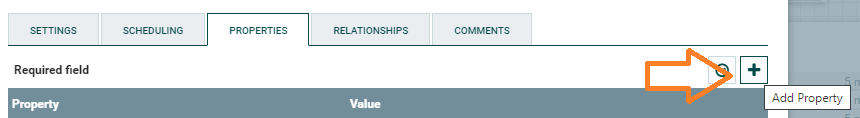
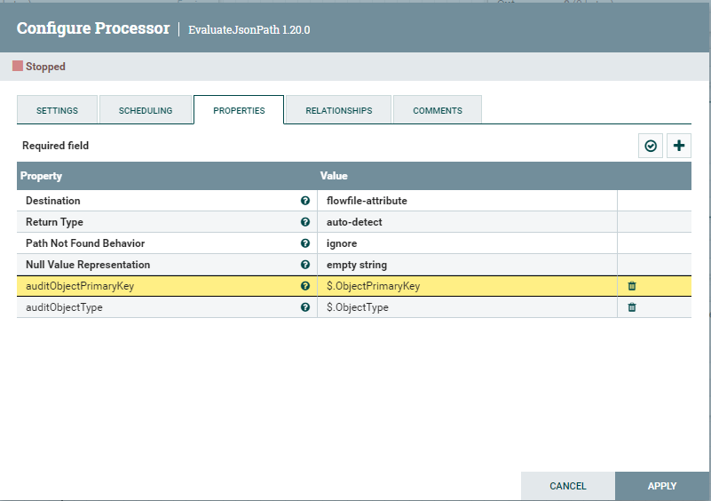

# Процессор условий RouteOnAttribute
Пример использования:

Есть некоторый JSON вида
```json
{
  "primaryKey" : "1f960832-2c19-42b7-a177-5ce417526385",
  "UserName" : "CHUREKOV Valentin",
  "UserLogin" : "VChurekov",
  "OperationId" : "57a2b6ab-4b5a-4d20-b808-46d5471ee6a2",
  "OperationTags" : "test3",
  "ObjectType" : "ProducingCountry",
  "ObjectPrimaryKey" : "9a03d556-0144-451f-b3ba-d281b47352ac",
  "OperationTime" : "2023-03-29 09:23:55",
  "OperationType" : "Edit"
}
```
Необходимо в зависимости от значения параметра **ObjectType** перенаправить обработку. 

При этом нас интересуют только 4 значения: **Brand, Car, ProducingCountry, SparePart.**

1. Добавляем процессор **EvaluateJsonPath** в рабочую область нашей группы процессоров. Он извлечет необходимые атрибуты для обработки.
<br/>Вкладка **Properties**, нажимаем кнопку **Add Property** и добавляем необходимые атрибуты и их значения (JSON селектор).
<br/>
<br/>В нашем случае это **auditObjectType = $.ObjectType**
<br/>

2. Добавляем процессор **RouteOnAttribute** в рабочую область нашей группы процессоров. 
<br/>Вкладка **Properties**, нажимаем кнопку **Add Property** и добавляем необходимые атрибуты и их значения (условия).
<br/>
<br/>В нашем случае это **Brand = \${auditObjectType:equals
('Brand')}**
<br/>**Car = \${auditObjectType:equals('Car')}**
<br/>**ProducingCountry = \${auditObjectType:equals('ProducingCountry')}**
<br/>**SparePart = \${auditObjectType:equals('SparePart')}**
<br/>

3. Выстраиваем очереди как нам это необходимо для обработки.
<br/>Пример:
<br/>