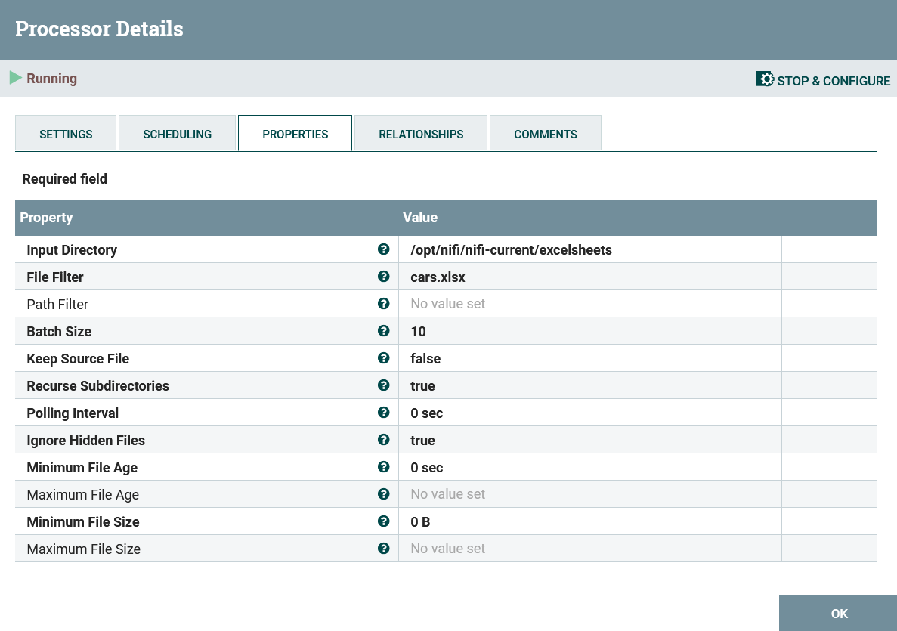
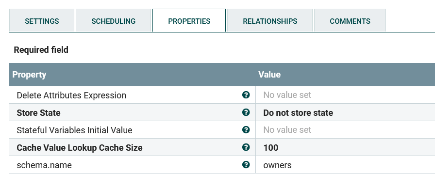
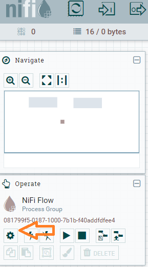
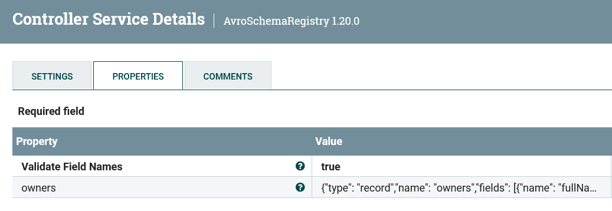
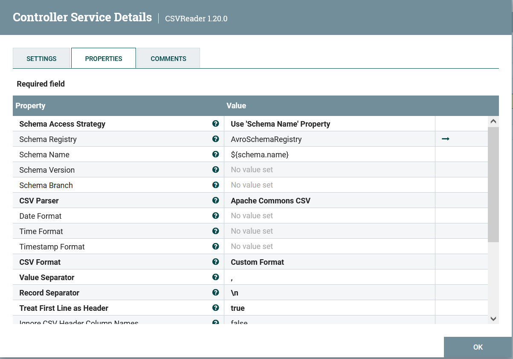
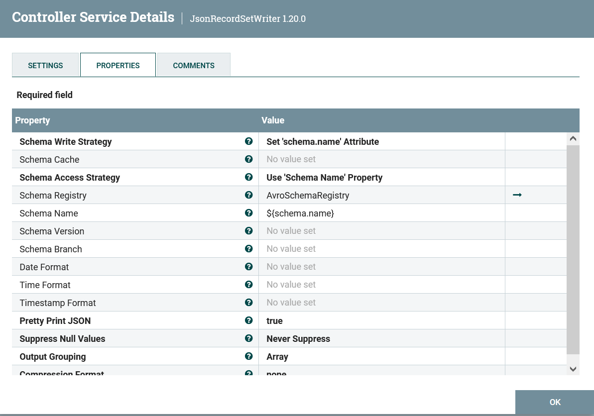
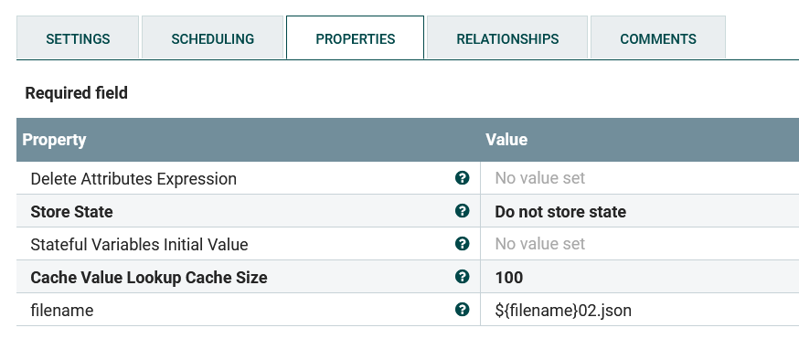
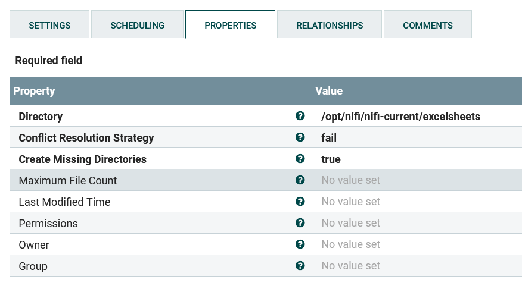
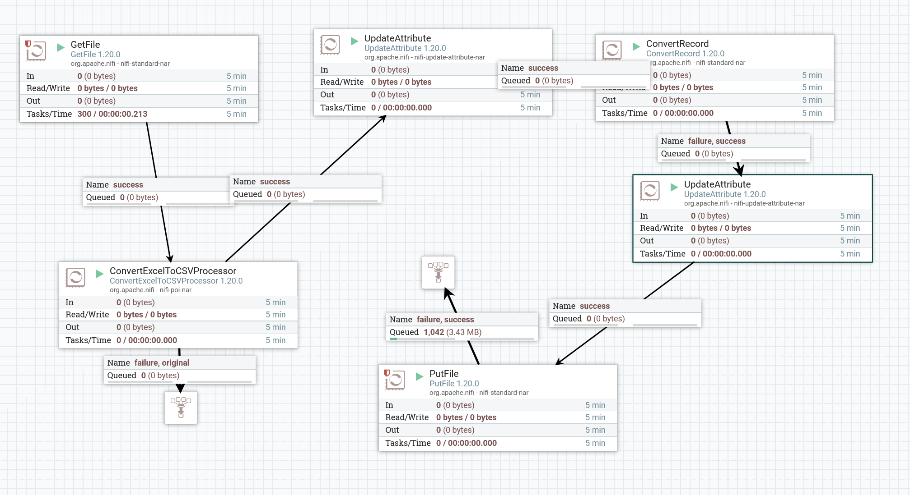

# Работа с Excel файлом в NiFi

## Подготовка файла

Положим файл в докер-контейнер. Для тестирования можно скопировать .xlsx файл с локальной машины в докер-контейнер nifi. Для этого:

1. Создаем файл, например `owners.xlsx` на локальной машине.
2. Присоединяемся терминалом (например, с помощью плагина Doker в VS Code) к контейнеру `nifisample/nifi`. Создадим директорию для файлов командой `mkdir excelsheets`
3. В другом, не подсоединенном к докеру терминале выполняем команду `docker cp <полный_путь_до_файла>\owners.xlsx <id_контейнера>:/opt/nifi/nifi-current/excelsheets/owners.xlsx`.

## Настройка файла в NiFi

### Загрузка файла в NiFi

1. Из меню сверху перетягиваем на рабочую зону Processor, из списка выбираем `GetFile`
2. На вкладке Properties:
   1. Input Directory - путь до файла в контейнере, в нашем случае `/opt/nifi/nifi-current/excelsheets`
   2. File Filter - фильтр на имя файла. Можно задавать маски, но в нашем тестовом случае прописываем имя конкретного файла - `owners.xlsx`

### Конвертация файла

1. Добавляем еще один Processor - `ConvertExcelToCSVProcessor`. На вкладке Properties в поле `Sheets to Extract` прописываем имена листов из excel файла, которые хотим передать. Этот процессор сконвертирует `.xlsx` в `.csv`. Если этот формат устраивает, то можно не проводить конвертацию дальше, но мы переведем файл в формат json.
2. Добавляем Processor `UpdateAttribute`, у которого на вкладке properties добавляем и прописываем свойство schema.name.
   
3. Добавляем Processor `ConvertRecord`
   1. На вкладке properties в поле `Record Reader` выбираем Create new service. В открывшемся окне выбираем `CSVReader`, нажимаем create.
   2. В поле `Record Writer` также выбираем Create new service. В открывшемся окне выбираем `JsonRecordSetWriter`
4. Дальше переходим в окно настройки контроллеров (тыкнуть в пустое место на рабочей области, слева в плашке Operate появится наш Process Group, кликаем на значок шестеренки).
   
5. Добавляем контроллер `AvroSchemaRegistry`. На вкладке properties создаем и заполняем свойство для парсинга файла. Имя свойства должно совпадать с именем схемы из шага 2. Например, для таблицы вида:

  | fullName    | buyDate     |
  | ----------- | ----------- |
  | Petrov Ivan Petrovich      | 10.10.2010       |
  | PaIvanov Artem Sergeevichragraph   | 21.09.2011        |

   Шаблон может выглядеть таким образом:
  
      {"type": "record","name": "owners","fields": [{"name": "fullName", "type": ["null", "string"]},{"name": "buyDate", "type": ["null", "int"], "logicalType": "date"}]}

  

6. В списке контроллеров находим созданный на 3 шаге `CSVReader`. Конфигурируем следующим образом:
   
7. Далее находим и настраиваем контроллер `JsonRecordsetWriter`:
   
8. Активируем все три контроллера.
9. Возвращаемся к основному рабочему пространству и добавляем еще один процессор `UpdateAttribute`. Добавляем ему свойство filename.
    
10.  Последовательно соединяем процессоры. Обращаем внимание, что стрелка от `ConvertExcelToCSVProcessor` к `UpdateAttribute` идет только в случае `success`. Если в UpdateAttribute попадет и сконвертированный файл, и оригинальный, выберет для дальнейшей работы он неверный.

### Выгрузка файла из NiFi

Выгружать файл необязательно. Можно отправить его по http. Можно остановиться на шагах предыдущего раздела (пропустив шаг 9) и продолжать работать с json данными в NiFi. Здесь мы выгружаем себе результат для наглядности.

Добавляем Processor `PutFile`. Его конфигурация может выглядеть так:
  
Включаем PutFile в общую схему, добавляем объект `Funnel` в конце.

Готовая схема может выглядеть как-то так:
  
