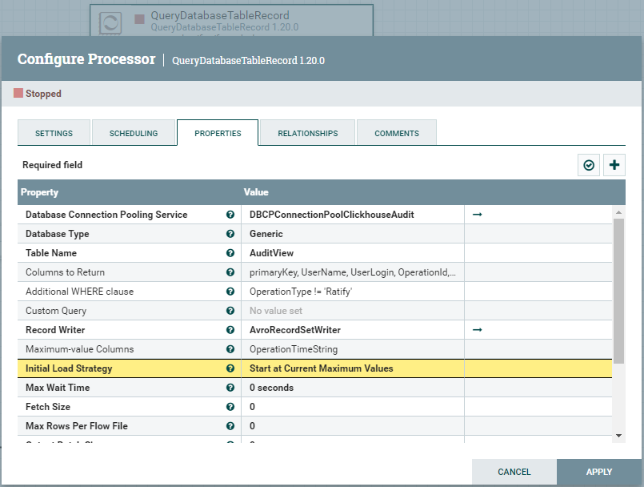
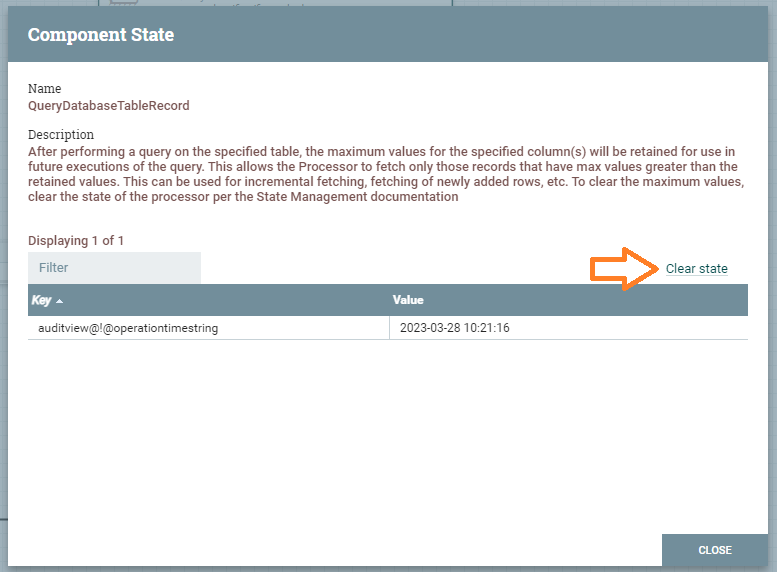
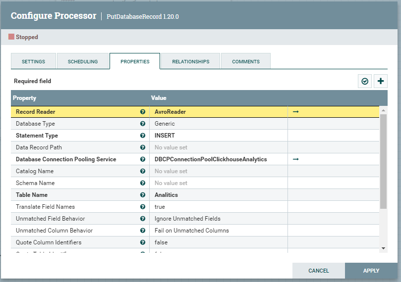
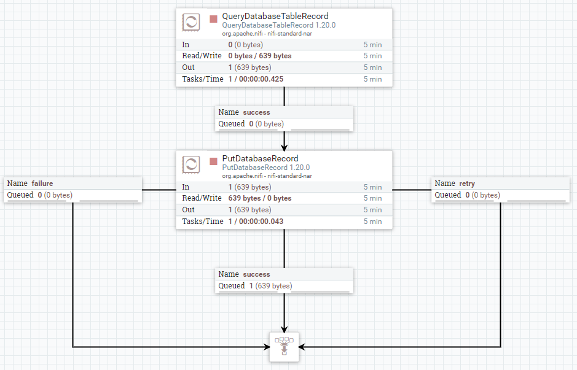

# Работа с БД Clickhouse, Audit в Analytics

## Описание задачи
Необходимо взять из БД Clickhouse Audit таблицу Audit по условию *OperationType != 'Ratify'* и положить в БД Clickhouse Analytics в таблицу Analitics.

Поля таблиц: primaryKey, OperationTime, OperationId, OperationTags, OperationType, ObjectType, UserName, UserLogin.

## Настройка представления AuditView
В NiFi при работе с полями типа **DateTime** из  Clickhouse возникают ошибки преобразования данных, дата преобразуется в формат **yyyy-MM-ddTHH:mm:ss** и в дальнейшем не могут из этого формата строки преобразоваться обратно.

Для решения проблемы добавили представление **AuditView**, где добавили поле **toString(OperationTime) as OperationTimeString**. Уже с этим полем будем в дальнейшем работать.
```sql
CREATE VIEW AuditView AS
SELECT primaryKey,
	UserName,
	UserLogin,
	OperationId,
	OperationTags,
	ObjectType,
	ObjectPrimaryKey,
	OperationTime,
	OperationType,
	ExecutionStatus,
	Source,
	SerializedFields,
	HeadAuditEntity,
	toString(OperationTime) as OperationTimeString
FROM Audit
```

Результирующий формат поля **yyyy-MM-dd HH:mm:ss**.

[Функции для работы с датами и временем](https://clickhouse.com/docs/ru/sql-reference/functions/date-time-functions)

## Вычитка данных из БД Clickhouse Audit
Для вычитки из базы данных есть процессоры:
* ExecuteSQL
* ExecuteSQLRecord
* QueryDatabaseTable
* QueryDatabaseTableRecord

Процессоры с припиской Record позволяют выбирать формат, в который будут преобразованы данные, например JSON, XML, CSV и т.п. По умолчанию это Avro формат.

**ExecuteSQL** просто выполняет запрос к БД и возвращает данные, в то время как QueryDatabaseTable позволяет каждый раз вычитывать только новые поступившие данные, т.е. выполнять дочитку строк таблицы.

Для наших нужд подходит только **QueryDatabaseTable**, т.к. перегонять каждый раз все данные очень накладно.

Промежуточный формат будем использовать Avro, поэтому не важно какой процессор мы выберем QueryDatabaseTable или QueryDatabaseTableRecord с указанием Avro формата.

Для более гибкой настройки и потенциальной возможности поменять внутренний формат данных, выберем процессор **QueryDatabaseTableRecord**.

## Настройка источников данных
Необходимо настроить подключение к БД Clickhouse Audit и к БД Clickhouse Analytics ([статья](%D0%9D%D0%B0%D1%81%D1%82%D1%80%D0%BE%D0%B9%D0%BA%D0%B0%20%D0%B8%D1%81%D1%82%D0%BE%D1%87%D0%BD%D0%B8%D0%BA%D0%BE%D0%B2%20%D0%B4%D0%B0%D0%BD%D0%BD%D1%8B%D1%85.md))

Назвать их **DBCPConnectionPoolClickhouseAudit** И **DBCPConnectionPoolClickhouseAnalytics** соответственно.

## Создание схемы взаимдействия

1. Добавляем процессор **QueryDatabaseTableRecord** в рабочую область нашей группы процессоров.
<br/>Вкладка **Properties**, атрибут **Database Connection Pooling Service** = DBCPConnectionPoolClickhouseAudit (выбрать из списка)
</br>Атрибут **Table Name** = AuditView
</br>Атрибут **Columns to Return** = primaryKey, UserName, UserLogin, OperationId, OperationTags, ObjectType, OperationTimeString as OperationTime, OperationType
</br>Атрибут **Additional WHERE clause** = OperationType != 'Ratify'
</br>Атрибут **Record Writer** = AvroRecordSetWriter (выбрать Create New Service... затем AvroRecordSetWriter)
</br>Атрибут **Maximum-value Columns** = OperationTimeString
</br>Атрибут **Initial Load Strategy** = **Start at Current Maximum Values** (если нужны только новые, при этом он вообще не загрузит старые) / **Start at Beginning** (загрузит все)
<br/>Активировать **AvroRecordSetWriter** в списке сервисов контроллеров группы процессов.
</br>
</br>
</br>Если выбрана опция **Start at Current Maximum Values** и необходимо сбросить макисмальное значение, то нужно нажать правой кнопкой мыши на процессоре **QueryDatabaseTableRecord**, в контекстном меню выбрать пункт **View state**. И в открывшейся форме нажать **Clear state**.
</br>

2. Добавляем процессор **PutDatabaseRecord** в рабочую область нашей группы процессоров.
<br/>Вкладка **Properties**, атрибут **Database Connection Pooling Service** = DBCPConnectionPoolClickhouseAnalytics (выбрать из списка)
</br>Атрибут **Table Name** = Analitics
</br>Атрибут **Statement Type** = INSERT
</br>Атрибут **Record Reader** = AvroReader (выбрать Create New Service... затем AvroReader)
<br/>Активировать **AvroReader** в списке сервисов контроллеров группы процессов.
</br>

3. Направляем поток **QueryDatabaseTableRecord** в **PutDatabaseRecord**.
<br/>Должна получится такая схема:
</br>