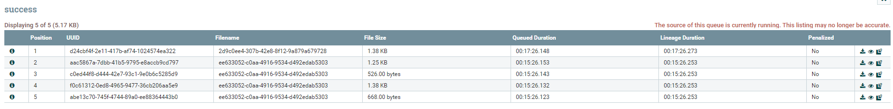
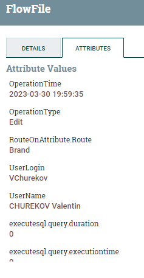
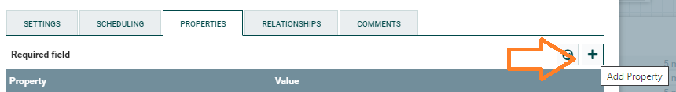
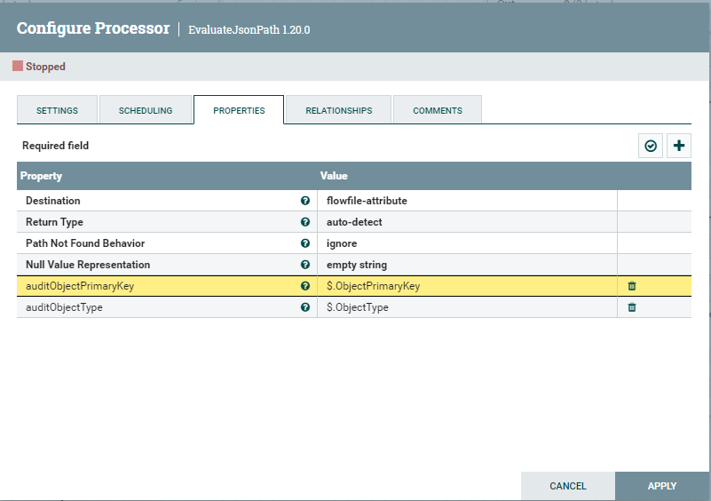
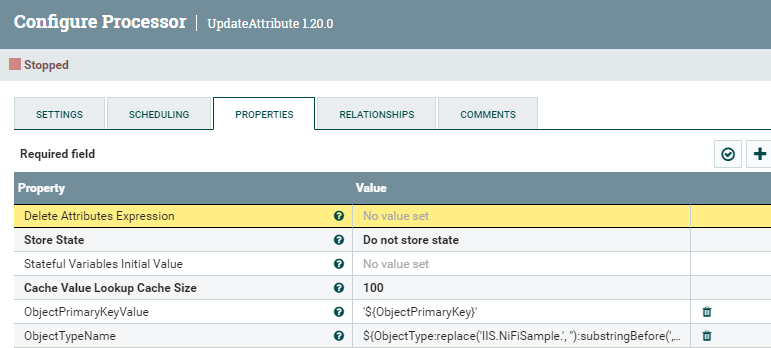
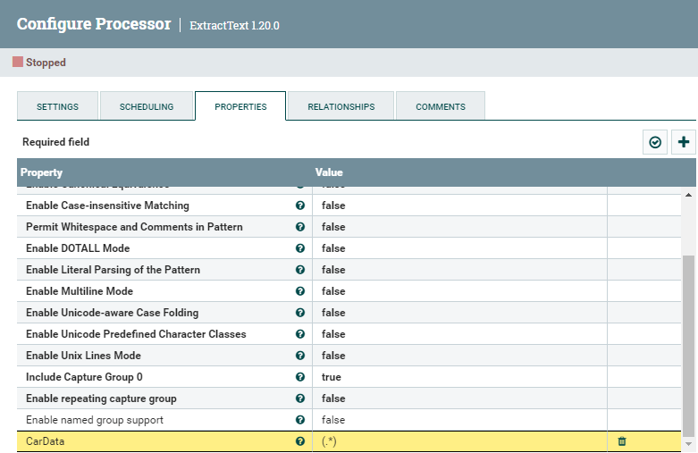

# Работа с атрибутами данных

У данных в очереди, помимо основного потока данных, есть собственные атрибуты.

Чтобы их посмотреть необходимо нажать на непустую очередь правой кнопкой и выбрать пункт **List queue**. Откроется список объектов в очереди.
 
 В каждой строке есть кнопки. 
 Справа нас интересует только кнопка 👁 - **View content** откроет в отдельном окне содержимое объекта (content).
 Кнопка слева 🛈 - **View details** показывает свойства объекта очереди. Если мы ее нажмем то во вкладке **Attributes** мы увилим атрибуты объекта, наши и системные.
 

## Извлечение атрибутов из JSON
Для извлечения атрибутов из JSON используется **EvaluateJsonPath** процессор.

Чтобы добавить атрибуты к потоку данных необходимо добавить их в свойствах процессора. 
 Во вкладке **Properties**, нажимаем кнопку **Add Property** и добавляем необходимые атрибуты и их значения (JSON селектор).
 
 И добавляем нужные нам атрибуты.
 
 Процессор извлечет из JSON нужные значение и добавит их к атрибутам объекта.

## Добавление/Удаление/Обновление атрибутов
Если есть необходимость 
* Добавить атрибут, который расчитывается на основоании других атрибутов;
* Обновить значение существующего атрибута;
* Удалить существующий атрибут.

То для этого используется процесор **UpdateAttribute**.
 Во вкладке **Properties**, нажимаем кнопку **Add Property** и добавляем необходимые атрибуты и их значения.
 
 Например нужно добавить атрибут ObjectPrimaryKeyValue, который продублирует ObjectPrimaryKey и поместит его в кавычки, и добавить атрибут ObjectTypeName, который извлекает имя типа из полного наименования.
 **ObjectPrimaryKeyValue** = '\${ObjectPrimaryKey}'
 **ObjectTypeName** = \${ObjectType:replace('IIS.NiFiSample.', ''):substringBefore(',')}
 ObjectTypeName из *IIS.NiFiSample.Brand, NiFiSample.Objects, Version=1.0.0.0, Culture=neutral, PublicKeyToken=null* извлечет значение *Brand*
 

Если имя добавленного атрибута совпадает с существующим атрибутом у объекта, то он будет заменен новым значением.

Для удаления атрибутов необходимо указать regex в поле **Delete Attributes Expression**. Будут удалены атрибуты, имена которых удовлетворят указанному выражению.

## Добавление атрибута на основании основного содержимого объекта
Если нужно добавить атрибут на основании основных данных из объекта, то используется процессор **ExtractText**.

 Во вкладке **Properties**, нажимаем кнопку **Add Property** и добавляем необходимые атрибуты и их значения (regex).
 
 Например нужно добавить атрибут CarData, который содержит весь текущий контент объекта.
 **CarData** = (.*)
 

## Перенаправление действий в зависимости от значения атрибутов
Если в зависимости от значения атрибутов необходимо перенаправить обработку объектов, то используется процессор **RouteOnAttribute**

[Основная статья: Процессор условий RouteOnAttribute](%D0%9F%D1%80%D0%BE%D1%86%D0%B5%D1%81%D1%81%D0%BE%D1%80%20%D1%83%D1%81%D0%BB%D0%BE%D0%B2%D0%B8%D0%B9%20RouteOnAttribute.md)

## Конвертация атрибутов в JSON
Если необъодимо из атрибутов объекта сформировать JSON, то используется процессор **AttributesToJSON**.

 Во вкладке **Properties**, поле **Attributes List** перечисляем через запятую те атрибуты, что попадут в JSON
 **Destination** = flowfile-content
 