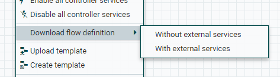
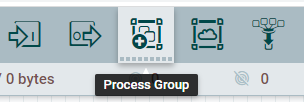
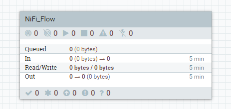

# Сохранение и загрузка групп процессов в JSON

## Сохранение

В NiFi можно сохранить группу процессов в JSON.
 Если мы хотим сохранить корневую группу процессов, то для этого надо нажать правой кнопкой мыши по пустому месту в рабочей области и выбрать пункт **Download flow definition** затем пункт **With external services**
 

В этом случае сохраняются все объекты группы процессоров, в том числе и сервисы контроллеров.

## Загрузка

Загрузить сохраненную группу процессоров в корневую группу невозможно.
 Вот почему мы создаем дочернюю группу процессоров в корневой группе.
 Для этого перетаскиваем объект **Process Group** с панели инструментов в рабочую область корневой группы.
 
 В открывшемся окне параметра указываем ранее сохраненный JSON группы процессов.
 В рабочей области должна отобразится группа процессов.
 
 Чтобы зайти в группу, нужно дважды кликнуть на нее или нажать правой кнопкой мыши и выбрать пункт **Enter group**.

Можно создавать группу процессов внутри другой группы и т.д.

Дочерняя группа процессов видит контроллеры сервисов своей родительской группы.